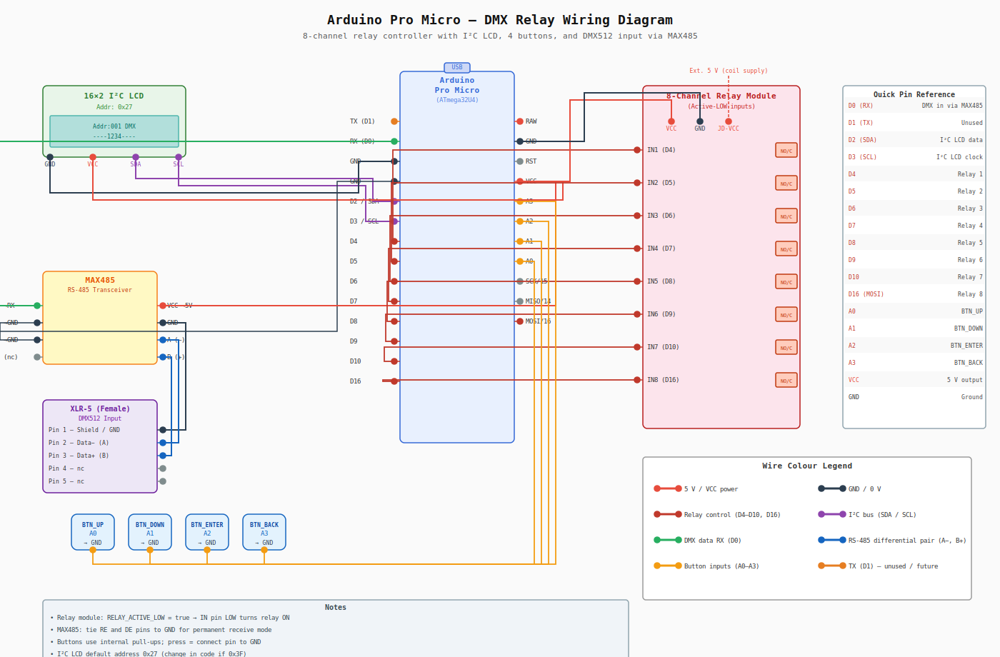

# Arduino Pro Micro – DMX Relay

An Arduino Pro Micro (ATmega32U4) firmware that listens for DMX512 packets and drives up to **8 relays** based on configurable channel values. A 16×2 I²C LCD and four push-buttons provide an on-device menu for address selection, manual relay override, and settings.

---

## Wiring Diagram



> **Full-resolution SVG:** [wiring-diagram.svg](wiring-diagram.svg)

---

## Hardware Components

| Component | Details |
|---|---|
| Microcontroller | Arduino Pro Micro (ATmega32U4, 5 V / 16 MHz) |
| Relay module | 8-channel, active-LOW inputs, opto-isolated (e.g. SainSmart) |
| Display | 16×2 LCD with I²C backpack (PCF8574, default address `0x27`) |
| DMX interface | MAX485 (or equivalent RS-485 transceiver) |
| DMX connector | XLR-5 female panel socket |
| Buttons | 4 × momentary push-buttons (NO) |

---

## Pin Connections

### Relay Module

| Pro Micro Pin | Relay Module Pin | Relay |
|---|---|---|
| D4 | IN1 | Relay 1 |
| D5 | IN2 | Relay 2 |
| D6 | IN3 | Relay 3 |
| D7 | IN4 | Relay 4 |
| D8 | IN5 | Relay 5 |
| D9 | IN6 | Relay 6 |
| D10 | IN7 | Relay 7 |
| D16 (MOSI) | IN8 | Relay 8 |
| VCC | VCC | Logic power |
| GND | GND | Ground |
| Ext. 5 V | JD-VCC | Relay-coil power (see note) |

> **JD-VCC note:** Power the relay coils from a separate 5 V supply connected to JD-VCC (remove the VCC–JD-VCC jumper). This isolates the MCU from relay-switching noise.

### I²C LCD (16×2)

| Pro Micro Pin | LCD Backpack Pin |
|---|---|
| D2 (SDA) | SDA |
| D3 (SCL) | SCL |
| VCC | VCC |
| GND | GND |

If your LCD does not illuminate after upload, try changing the I²C address from `0x27` to `0x3F` in the sketch.

### Push-Buttons

Each button connects between the listed pin and **GND**. The firmware enables internal pull-ups, so no external resistor is needed.

| Button | Pro Micro Pin |
|---|---|
| UP | A0 |
| DOWN | A1 |
| ENTER | A2 |
| BACK | A3 |

### DMX512 Input (via MAX485)

```
XLR-5 Pin 1 (Shield/GND) ──► GND
XLR-5 Pin 2 (Data −)     ──► MAX485 A
XLR-5 Pin 3 (Data +)     ──► MAX485 B

MAX485 RO  ──► Pro Micro D0 (RX)
MAX485 RE  ──► GND  (tie to GND – permanent receive)
MAX485 DE  ──► GND  (tie to GND – permanent receive)
MAX485 DI  ──  not connected
MAX485 VCC ──► 5 V
MAX485 GND ──► GND
```

Use **shielded twisted-pair** DMX cable; connect the shield to XLR pin 1.

### Recommended Wire Gauges

| Wire type | Gauge |
|---|---|
| Signal (relay IN, buttons, I²C, DMX) | 22 AWG |
| Power / GND rails | 18 AWG |
| Relay load (switched circuit) | Size to load current |

---

## Powering the Board

The Pro Micro can be powered in two ways:

| Input pin | Voltage | Notes |
|---|---|---|
| **RAW** | 7 – 12 V | Passes through the on-board 5 V regulator — preferred for wall adapters |
| **VCC** | 5 V regulated | Bypasses the regulator — use only with a clean, regulated 5 V supply |

> **Transformer / wall-adapter tips**
>
> * Always use the **RAW** pin with an unregulated wall adapter. Connecting an unregulated supply directly to VCC can damage the microcontroller.
> * If you must use VCC, ensure the supply is **regulated** and provides at least **500 mA** to cover the MCU, LCD backlight, relay coils, and MAX485 transceiver simultaneously.
> * Add a **100 µF electrolytic** capacitor between VCC and GND close to the Pro Micro to suppress inrush and switching noise that can cause spurious resets on power-up.
> * Cheap USB chargers and unfiltered transformer adapters often have noisy or slowly-rising outputs. The firmware includes a short stabilisation delay at startup to give all peripherals time to reach their operating voltage before initialisation begins, but a poor-quality supply may still cause issues.

---

## Software

### Dependencies

Install the following libraries via the Arduino Library Manager before compiling:

| Library | Purpose |
|---|---|
| [DMXSerial](https://github.com/mathertel/DMXSerial) | DMX512 receive |
| [LiquidCrystal_I2C](https://github.com/johnrickman/LiquidCrystal_I2C) | I²C LCD driver |
| Wire (built-in) | I²C bus |
| EEPROM (built-in) | Persistent settings |

### Upload Settings

| Setting | Value |
|---|---|
| Board | Arduino Leonardo (or "Pro Micro" via SparkFun board package) |
| Processor | ATmega32U4 (5 V, 16 MHz) |
| Port | The COM/tty port that appears when the Pro Micro is plugged in |

### Powering from an External 5 V Supply

When the board is powered via USB the USB bootloader waits roughly 8 seconds before launching the firmware, giving all peripherals time to stabilize. When powered from an external 5 V transformer the MCU boots immediately, which can starve the I²C LCD backpack of its initialization window and leave the I²C bus stuck — causing the firmware to hang before `loop()` ever runs (buttons and relays both appear dead).

The firmware already accounts for this with:

1. **500 ms startup delay** at the beginning of `setup()` so relay module, LCD, and MAX485 all have time to reach their operating states.
2. **I²C bus recovery** — up to 9 SCL clock pulses are driven before `Wire.begin()` to release any slave that is holding SDA low.

**Power-supply requirements when not using USB:**

| Parameter | Minimum | Recommended |
|---|---|---|
| Voltage | 4.75 V | 5.0 V |
| Current | 500 mA | 1 A or more |
| Ripple | — | < 50 mV pp |

Use a regulated 5 V DC supply with adequate current headroom for all 8 relay coils plus the MCU, LCD, and MAX485. A supply rated below ~500 mA may brown-out under the inrush when multiple relays switch simultaneously.

---

## Operation

### Home Screen

```
  Addr:001 DMX
    ----1234----
```

- **Addr** – current DMX start channel (1–505).
- **DMX / MAN** – current source (DMX input or manual override).
- Bottom row – relay states; digits 1–8 = ON, dash = OFF.

### Buttons on the Home Screen

| Button | Action |
|---|---|
| UP / DOWN | Increment / decrement DMX start address |
| ENTER | Open the menu |
| BACK | Toggle manual-override mode |

### Menu

| Item | Description |
|---|---|
| Manual Control | Individually toggle each relay on/off |
| Settings | Adjust DMX thresholds, timeout, and failsafe mode |

### Settings

| Parameter | Default | Description |
|---|---|---|
| ON threshold | 128 | DMX value that turns a relay ON |
| OFF threshold | 120 | DMX value that turns a relay OFF (hysteresis) |
| RX wait (ms) | 30 | How long each DMX probe waits for a packet |
| Timeout (ms) | 1000 | Declare "no DMX" after this many ms without a packet |
| Failsafe | All OFF | Behaviour when DMX is lost: **All OFF** or **Hold last** |

All settings are saved to EEPROM automatically 1.5 s after the last change.

---

## Wire Colour Convention (diagram)

| Colour | Signal |
|---|---|
| Red | 5 V / VCC |
| Black | GND |
| Dark red | Relay control (D4–D10, D16) |
| Purple | I²C bus (SDA / SCL) |
| Green | DMX RX (D0) |
| Blue | RS-485 differential pair (A−, B+) |
| Amber/yellow | Button inputs (A0–A3) |
| Orange | TX (D1) – unused / future |

---

## License

This project is released under the MIT License. See [LICENSE](LICENSE) for details.